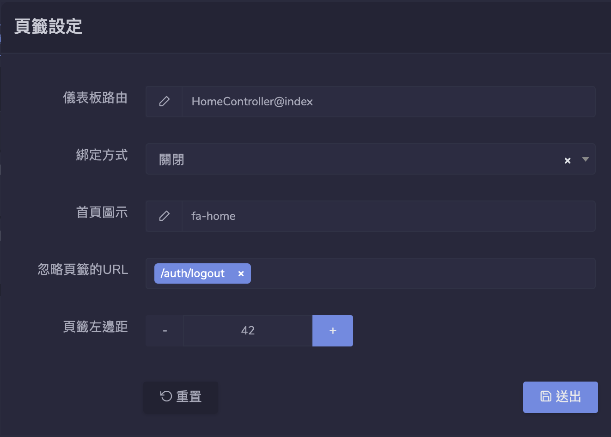

# Dcat Admin IFrame 多窗口扩展

## 安裝

1. 安裝擴展。

   ```bash
   composer require elysiumrealms/extension-iframe-tabs
   ```

2. 在後台「開發工具」「擴展」更新至最新版本，並啟用擴展。

    

3. 透過「擴展設置」設定「儀表板路由」。

    

4. 清除緩存數據。

   ```bash
   php artisan cache:clear
   php artisan view:clear
   ```

5. 重新整理頁面。

    

## 自定義 HTML 類別

- 添加彈跳窗口。

```html
<a class="pop-link" href="popup"></a>
```

- 添加 iframe 窗口。

```html
<a class="iframe-link" href="iframe"></a>
```
